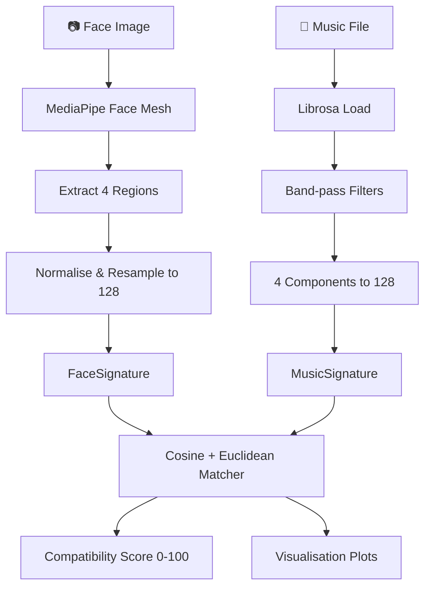

# 🎭🎵 Face Music Matcher

> **Experimental system for mathematical comparison between facial geometry and musical structure.**

---

## 📌 Objective

Face Music Matcher is a **pure mathematical system** that compares the geometry of a human face with the structure of a music track. It does **NOT** predict personality, emotions, or musical tastes.

The core idea:

- A **face** is treated as a set of **geometric curves**.
- A **song** is treated as a set of **sound curves**.
- The system generates **mathematical signatures** for both.
- The system calculates a **compatibility score** between face and music.

This is a computational geometry + digital signal processing experiment. There are no psychological premises.

---

## 🏗️ Architecture

```
┌──────────────────────────────────────────────────────┐
│                     API Layer                        │
│  POST /compare  (FastAPI)                            │
│  multipart/form-data: image + music                  │
└──────────────────────┬───────────────────────────────┘
                       │
┌──────────────────────▼───────────────────────────────┐
│                  Use Cases                           │
│  ExtractFaceSignatureUseCase                         │
│  ExtractMusicSignatureUseCase                        │
│  CompareFaceAndMusicUseCase                          │
└──────────────────────┬───────────────────────────────┘
                       │
┌──────────────────────▼───────────────────────────────┐
│               Domain (Entities + Interfaces)         │
│  FaceSignature, MusicSignature, ComparisonResult     │
│  FaceExtractor, MusicExtractor, Matcher, PlotGenerator│
└──────────────────────┬───────────────────────────────┘
                       │
┌──────────────────────▼───────────────────────────────┐
│             Infrastructure Adapters                  │
│  MediaPipeFaceExtractor  (MediaPipe Face Mesh)       │
│  LibrosaMusicExtractor   (Librosa + SciPy)           │
│  CosineEuclideanMatcher  (Cosine + Euclidean)        │
│  MatplotlibPlotGenerator (Matplotlib)                │
└──────────────────────────────────────────────────────┘
```

### Design Principles

| Principle       | Applied Through                                    |
|-----------------|----------------------------------------------------|
| **SOLID**       | ABC interfaces, single-responsibility adapters     |
| **Clean Arch**  | Domain ← Use Cases ← Infrastructure               |
| **Clean Code**  | Type hints, docstrings, descriptive names          |
| **Pydantic**    | Request/response validation                        |

---

## 🔄 System Flow



### Face ↔ Music Mapping

| Face Region   | Music Component     | Rationale                                         |
|---------------|---------------------|---------------------------------------------------|
| **Jawline**   | **Bass**            | Structural foundation of face / sonic foundation  |
| **Eyebrows**  | **Rhythm**          | Temporal articulation / rhythmic pulse            |
| **Nose**      | **Mid Frequencies** | Central prominence / harmonic body                |
| **Mouth**     | **Treble**          | Expressive detail / high-frequency texture        |

---

## 📂 Project Structure

```
face_music_matcher/
├── app/
│   ├── api/
│   │   ├── routes/          # FastAPI route handlers
│   │   └── schemas/         # Pydantic request/response models
│   ├── core/
│   │   ├── config.py        # Application configuration
│   │   └── exceptions.py    # Custom exception classes
│   ├── domain/
│   │   ├── entities/        # FaceSignature, MusicSignature, etc.
│   │   ├── interfaces/      # ABCs for adapters
│   │   └── services/        # Domain services (future)
│   ├── infrastructure/
│   │   ├── vision/          # MediaPipe face extractor
│   │   ├── audio/           # Librosa music extractor
│   │   ├── matching/        # Cosine + Euclidean matcher
│   │   └── storage/         # Plot generator
│   └── use_cases/           # Application use cases
├── tests/                   # Pytest test suite
├── uploads/                 # Temporary file storage
├── outputs/                 # Generated visualisation plots
├── requirements.txt
└── main.py                  # CLI + Server entry point
```

---

## 🚀 Installation

### Prerequisites

- Python **3.12+**
- pip

### Setup

```bash
# Clone the repository
git clone <repo-url>
cd face_music_matcher

# Create a virtual environment
python -m venv .venv

# Activate it
# Windows:
.venv\Scripts\activate
# Linux/macOS:
source .venv/bin/activate

# Install dependencies
pip install -r requirements.txt
```

---

## 🖥️ Usage

### CLI Mode

```bash
python main.py --image photo.jpg --music song.mp3
```

Output:

```
🔍 Analysing face: photo.jpg
🎵 Analysing music: song.mp3
──────────────────────────────────────────────────

  Compatibility: 87.35%

  Component scores:
    jaw_bass              85.00%
    eyebrow_rhythm        90.00%
    nose_mid              88.00%
    mouth_treble          86.40%

  Plots saved to: outputs/
    face_curve: outputs/face_curve.png
    music_curve: outputs/music_curve.png
    overlay_comparison: outputs/overlay_comparison.png

✅ Comparison complete.
```

JSON output:

```bash
python main.py --image photo.jpg --music song.mp3 --json
```

### Server Mode (FastAPI)

```bash
python main.py --server
# or with custom host/port:
python main.py --server --host 0.0.0.0 --port 8080
```

Then visit:

- **Swagger UI**: http://127.0.0.1:8000/docs
- **ReDoc**: http://127.0.0.1:8000/redoc

---

## 📡 API Reference

### `POST /compare`

Multipart form-data endpoint.

**Request:**

| Field   | Type | Required | Description               |
|---------|------|----------|---------------------------|
| `image` | file | Yes      | Face image (JPEG or PNG)  |
| `music` | file | Yes      | Music file (WAV or MP3)   |

**Example (curl):**

```bash
curl -X POST http://127.0.0.1:8000/compare \
  -F "image=@photo.jpg" \
  -F "music=@song.mp3"
```

**Response (200):**

```json
{
  "compatibility": 87.35,
  "face_score": {
    "jaw_vector": [0.12, 0.15, "..."],
    "eyebrow_vector": [0.08, 0.11, "..."],
    "nose_vector": [0.22, 0.25, "..."],
    "mouth_vector": [0.05, 0.09, "..."]
  },
  "music_score": {
    "bass_vector": [0.10, 0.13, "..."],
    "mid_vector": [0.20, 0.22, "..."],
    "treble_vector": [0.05, 0.08, "..."],
    "rhythm_vector": [0.30, 0.33, "..."]
  },
  "component_scores": {
    "jaw_bass": 85.0,
    "eyebrow_rhythm": 90.0,
    "nose_mid": 88.0,
    "mouth_treble": 86.4
  },
  "plot_paths": {
    "face_curve": "outputs/face_curve.png",
    "music_curve": "outputs/music_curve.png",
    "overlay_comparison": "outputs/overlay_comparison.png"
  }
}
```

---

## 🧪 Testing

```bash
# Run all tests
pytest

# With coverage report
pytest --cov=app --cov-report=term-missing --cov-report=html
```

---

## 🧠 Technical Details

### Face Extraction (MediaPipe)

1. Load image with OpenCV.
2. Detect 468 face landmarks via MediaPipe Face Mesh.
3. Select 4 regions: jawline, eyebrows, nose, mouth.
4. Centre and normalise coordinates (translation + scale invariance).
5. Convert each 2D curve to 1D vector via arc-length interpolation (512 to 128).

### Music Processing (Librosa)

1. Load audio in mono at 22,050 Hz.
2. Apply Butterworth band-pass filters:
   - **Bass**: 20–250 Hz
   - **Mid**: 250–2,000 Hz
   - **Treble**: 2,000–8,000 Hz
3. Compute waveform envelope for each band.
4. Extract RMS energy for rhythm.
5. Resample all components to 128 points with min-max normalisation.

### Matching (Cosine + Euclidean)

- **Cosine similarity**: Measures directional alignment (scale-invariant).
- **Euclidean distance**: Measures absolute distance (normalised).
- Combined formula: `score = 0.7 * cosine + 0.3 * euclidean`.
- Final output scaled to 0–100%.

---

## 🔮 Architecture Prepared for Future Expansion

The Clean Architecture design makes it straightforward to add:

1. **Face Playlist** — Match a face against multiple songs.
2. **Multi-song compatibility** — Compare one face to an entire library.
3. **Music ranking** — Sort songs by compatibility score.
4. **YouTube URL upload** — Download and process audio from URLs.
5. **Persistent face signatures** — Store signatures for reuse.

These features are not yet implemented, but the interface-based design means they can be added by creating new adapters and use cases without modifying existing code.

---

## ⚠️ Important Notes

- No database.
- No AI / generative models.
- No neural networks.
- No emotion classification.
- No personality inference.
- No musical taste prediction.
- Pure mathematics: geometric curve similarity.

---

## 📄 License

MIT