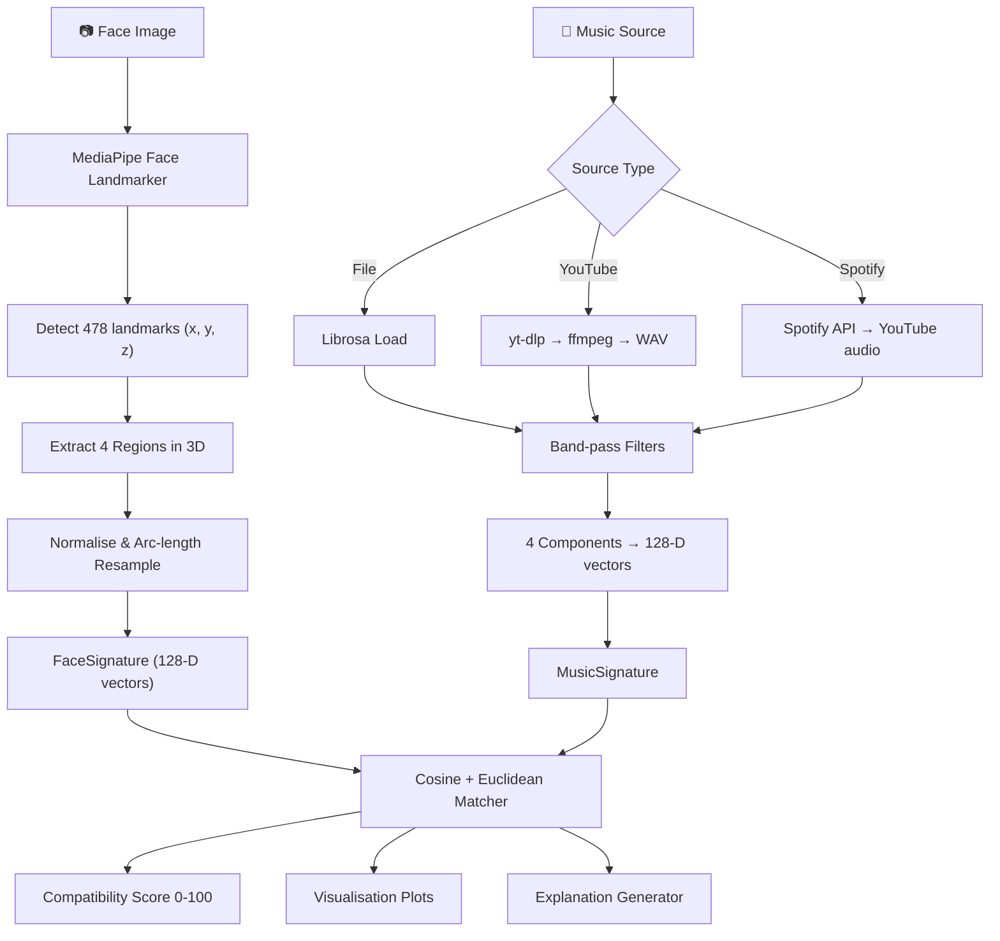

# 🎭🎵 Face Music Matcher

> **Experimental system for mathematical comparison between facial geometry and musical structure.**

---

## 📌 Objective

Face Music Matcher is a **pure mathematical system** that compares the geometry of a human face with the structure of a music track. It does **NOT** predict personality, emotions, or musical tastes.

The core idea:

- A **face** is treated as a set of **geometric curves**.
- A **song** is treated as a set of **sound curves**.
- The system generates **mathematical signatures** for both.
- The system calculates a **compatibility score** between face and music.

This is a computational geometry + digital signal processing experiment. There are no psychological premises.

---

## 🏗️ Architecture

```
┌──────────────────────────────────────────────────────────────┐
│                     Frontend (SPA)                           │
│  📷 Webcam capture  |  📁 File upload  |  🎬 YouTube  |  🟢 Spotify │
└──────────────────────────┬───────────────────────────────────┘
                           │
┌──────────────────────────▼───────────────────────────────────┐
│                       API Layer (FastAPI)                    │
│  POST /compare          — image + music file                │
│  POST /compare/youtube  — image + YouTube URL               │
│  POST /compare/spotify  — image + search query → ranking    │
└──────────────────────────┬───────────────────────────────────┘
                           │
┌──────────────────────────▼───────────────────────────────────┐
│                      Use Cases                               │
│  ExtractFaceSignatureUseCase                                 │
│  ExtractMusicSignatureUseCase                                │
│  CompareFaceAndMusicUseCase                                  │
└──────────────────────────┬───────────────────────────────────┘
                           │
┌──────────────────────────▼───────────────────────────────────┐
│               Domain (Entities + Interfaces)                 │
│  FaceSignature, MusicSignature, ComparisonResult             │
│  FaceExtractor, MusicExtractor, Matcher, PlotGenerator       │
└──────────────────────────┬───────────────────────────────────┘
                           │
┌──────────────────────────▼───────────────────────────────────┐
│                 Infrastructure Adapters                      │
│  MediaPipeFaceExtractor   (MediaPipe Face Landmarker 3D)     │
│  LibrosaMusicExtractor    (Librosa + SciPy)                  │
│  YouTubeAudioDownloader   (yt-dlp + ffmpeg)                  │
│  SpotifyClient            (Spotify Web API)                  │
│  CosineEuclideanMatcher   (Cosine + Euclidean)               │
│  MatplotlibPlotGenerator  (Matplotlib)                       │
│  ExplanationGenerator     (Natural language explanations)    │
└──────────────────────────────────────────────────────────────┘
```

### Design Principles

| Principle       | Applied Through                                    |
|-----------------|----------------------------------------------------|
| **SOLID**       | ABC interfaces, single-responsibility adapters     |
| **Clean Arch**  | Domain ← Use Cases ← Infrastructure               |
| **Clean Code**  | Type hints, docstrings, descriptive names          |
| **Pydantic**    | Request/response validation                        |

---

## 🔄 System Flow



### Face ↔ Music Mapping

| Face Region   | Music Component     | Rationale                                         |
|---------------|---------------------|---------------------------------------------------|
| **Jawline**   | **Bass**            | Structural foundation of face / sonic foundation  |
| **Eyebrows**  | **Rhythm**          | Temporal articulation / rhythmic pulse            |
| **Nose**      | **Mid Frequencies** | Central prominence / harmonic body                |
| **Mouth**     | **Treble**          | Expressive detail / high-frequency texture        |

---

## 📂 Project Structure

```
face_music_matcher/
├── app/
│   ├── api/
│   │   ├── routes/          # FastAPI route handlers
│   │   └── schemas/         # Pydantic request/response models
│   ├── core/
│   │   ├── config.py        # Application configuration
│   │   └── exceptions.py    # Custom exception classes
│   ├── domain/
│   │   ├── entities/        # FaceSignature, MusicSignature, etc.
│   │   ├── interfaces/      # ABCs for adapters
│   │   └── services/        # Domain services (future)
│   ├── infrastructure/
│   │   ├── vision/          # MediaPipe face extractor
│   │   ├── audio/           # Librosa music extractor
│   │   ├── matching/        # Cosine + Euclidean matcher
│   │   └── storage/         # Plot generator
│   └── use_cases/           # Application use cases
├── tests/                   # Pytest test suite (53 tests, 89% coverage)
├── uploads/                 # Temporary file storage
├── outputs/                 # Generated visualisation plots
├── .env                     # Spotify API credentials (gitignored)
├── .gitignore
├── .dockerignore
├── Dockerfile               # Container with Python 3.12 + ffmpeg
├── render.yaml              # Render.com deployment config
├── requirements.txt
└── main.py                  # CLI + Server entry point
```

---

## 🚀 Installation

### Prerequisites

- Python **3.12+**
- pip

### Setup

```bash
# Clone the repository
git clone <repo-url>
cd face_music_matcher

# Create a virtual environment
python -m venv .venv

# Activate it
# Windows:
.venv\Scripts\activate
# Linux/macOS:
source .venv/bin/activate

# Install dependencies
pip install -r requirements.txt
```

---

## 🖥️ Usage

### CLI Mode

```bash
python main.py --image photo.jpg --music song.mp3
```

Output:

```
🔍 Analysing face: photo.jpg
🎵 Analysing music: song.mp3
──────────────────────────────────────────────────

  Compatibility: 87.35%

  Component scores:
    jaw_bass              85.00%
    eyebrow_rhythm        90.00%
    nose_mid              88.00%
    mouth_treble          86.40%

  Plots saved to: outputs/
    face_curve: outputs/face_curve.png
    music_curve: outputs/music_curve.png
    overlay_comparison: outputs/overlay_comparison.png

✅ Comparison complete.
```

JSON output:

```bash
python main.py --image photo.jpg --music song.mp3 --json
```

### Server Mode (FastAPI)

```bash
python main.py --server
# or with custom host/port:
python main.py --server --host 0.0.0.0 --port 8080
```

Then open the **interactive frontend** at:

- **Frontend**: http://127.0.0.1:8000
- **Swagger UI**: http://127.0.0.1:8000/docs
- **ReDoc**: http://127.0.0.1:8000/redoc

### Webcam Capture

```bash
python main.py --camera --music song.mp3
```

Opens the webcam with a live preview. Press **SPACE** to capture, **ESC** to quit.

---

## 🖥️ Frontend

The interactive frontend supports **three music input modes**:

| Tab | Description |
|-----|-------------|
| 📁 **Ficheiro** | Upload a face photo + MP3/WAV file |
| 🎬 **YouTube** | Upload a face photo + paste a YouTube link |
| 🟢 **Spotify** | Upload a face photo + search artist/track → ranked results |

All modes include:
- 📷 Webcam capture with preview
- 📊 Component score bars (Jawline↔Bass, Eyebrows↔Rhythm, Nose↔Mid, Mouth↔Treble)
- 📈 Comparison plots (face curves, music curves, overlay)
- 📝 Natural language explanations for each score

---

## 📡 API Reference

### `POST /compare`

Upload image + music file.

**Request:**

| Field   | Type | Required | Description               |
|---------|------|----------|---------------------------|
| `image` | file | Yes      | Face image (JPEG or PNG)  |
| `music` | file | Yes      | Music file (WAV or MP3)   |

### `POST /compare/youtube`

Upload image + YouTube URL.

| Field        | Type   | Required | Description                          |
|--------------|--------|----------|--------------------------------------|
| `image`      | file   | Yes      | Face image (JPEG or PNG)             |
| `youtube_url`| string | Yes      | YouTube URL (watch or youtu.be)      |

### `POST /compare/spotify`

Upload image + search query → ranked results.

| Field        | Type   | Required | Description                          |
|--------------|--------|----------|--------------------------------------|
| `image`      | file   | Yes      | Face image (JPEG or PNG)             |
| `query`      | string | Yes      | Search query (artist or track name)  |
| `search_type`| string | No       | `"artist"` (default) or `"track"`     |

**Spotify Response:**

```json
{
  "query": "Billie Eilish",
  "total_tracks_found": 5,
  "tracks_analyzed": 5,
  "results": [
    {
      "track_name": "bad guy",
      "artist": "Billie Eilish",
      "album": "WHEN WE ALL FALL ASLEEP",
      "compatibility": 73.5,
      "component_scores": {
        "jaw_bass": 70.1,
        "eyebrow_rhythm": 82.3,
        "nose_mid": 74.0,
        "mouth_treble": 67.6
      },
      "spotify_url": "https://open.spotify.com/track/..."
    }
  ],
  "plot_paths": { "face_curve": "...", "music_curve": "...", "overlay_comparison": "..." },
  "explanation": { "overall": "...", "pairs": { ... } }
}
```

**Example (curl):**

```bash
# File upload
curl -X POST http://127.0.0.1:8000/compare \
  -F "image=@photo.jpg" \
  -F "music=@song.mp3"

# YouTube
curl -X POST http://127.0.0.1:8000/compare/youtube \
  -F "image=@photo.jpg" \
  -F "youtube_url=https://www.youtube.com/watch?v=..."

# Spotify
curl -X POST http://127.0.0.1:8000/compare/spotify \
  -F "image=@photo.jpg" \
  -F "query=Billie Eilish" \
  -F "search_type=artist"
```

**Response (200):**

```json
{
  "compatibility": 87.35,
  "face_score": {
    "jaw_vector": [0.12, 0.15, "..."],
    "eyebrow_vector": [0.08, 0.11, "..."],
    "nose_vector": [0.22, 0.25, "..."],
    "mouth_vector": [0.05, 0.09, "..."]
  },
  "music_score": {
    "bass_vector": [0.10, 0.13, "..."],
    "mid_vector": [0.20, 0.22, "..."],
    "treble_vector": [0.05, 0.08, "..."],
    "rhythm_vector": [0.30, 0.33, "..."]
  },
  "component_scores": {
    "jaw_bass": 85.0,
    "eyebrow_rhythm": 90.0,
    "nose_mid": 88.0,
    "mouth_treble": 86.4
  },
  "plot_paths": {
    "face_curve": "outputs/abc123_face_curve.png",
    "music_curve": "outputs/abc123_music_curve.png",
    "overlay_comparison": "outputs/abc123_overlay_comparison.png"
  },
  "explanation": {
    "overall": "Compatibilidade alta (87.4%) entre o rosto e a música...",
    "pairs": {
      "jaw_bass": { "score": 85.0, "level": "Forte alinhamento", ... }
    }
  }
}
```

---

## 🧪 Testing

```bash
# Run all tests (53 tests)
pytest

# With coverage report (89% coverage)
pytest --cov=app --cov-report=term-missing --cov-report=html
```

## 🐳 Deployment

The project includes a `Dockerfile` (Python 3.12 + ffmpeg) and `render.yaml` for
easy deployment to Render.com (free tier). Also compatible with AWS, Fly.io,
Railway, and Google Cloud Run.

```bash
# Build and run locally
docker build -t face-music-matcher .
docker run -p 8000:8000 face-music-matcher
```

## 🔑 Environment Variables

| Variable | Required | Description |
|----------|----------|-------------|
| `SPOTIFY_CLIENT_ID` | For Spotify | Spotify API client ID |
| `SPOTIFY_CLIENT_SECRET` | For Spotify | Spotify API client secret |

Create a `.env` file in the project root:

```
SPOTIFY_CLIENT_ID=your_client_id
SPOTIFY_CLIENT_SECRET=your_client_secret
```

---

## 🧠 Technical Details

### Face Extraction (MediaPipe — 3D)

1. Load image with OpenCV.
2. Detect **478 face landmarks (x, y, z)** via MediaPipe Face Landmarker.
3. Select 4 regions: jawline, eyebrows, nose, mouth.
4. Centre and normalise **3D coordinates** (translation + scale invariance).
5. Arc-length interpolation along the 3D curve → interleave (x,y,z) → 768 pts.
6. Downsample to **128-D vector** with min-max normalisation.

The `z` coordinate (depth) makes the signature more robust to head pose variations
than pure 2D (x,y) extraction.

### Spotify Integration

1. Search Spotify API for tracks matching the query (`artist:NAME` or `track:NAME`).
2. For each track, search YouTube via `yt-dlp` (`ytsearch:track_name artist`).
3. Download and convert to WAV via ffmpeg.
4. Extract MusicSignature and compare with FaceSignature.
5. Return top N results ranked by compatibility.

Requires `SPOTIFY_CLIENT_ID` and `SPOTIFY_CLIENT_SECRET` environment variables
(see `.env` file). Get credentials at https://developer.spotify.com/dashboard.

### YouTube Audio Extraction

Uses `yt-dlp` to download audio from YouTube URLs. Requires `ffmpeg` for WAV
conversion (installed automatically via the Dockerfile).

- YouTube links: `https://www.youtube.com/watch?v=...` or `https://youtu.be/...`
- Also supports `ytsearch:query` for programmatic search.

### Explanation Generator

Produces natural language (Portuguese) explanations for each compatibility score,
describing what each face region and music component represent and why they are
paired together.

### Music Processing (Librosa)

1. Load audio in mono at 22,050 Hz.
2. Apply Butterworth band-pass filters:
   - **Bass**: 20–250 Hz
   - **Mid**: 250–2,000 Hz
   - **Treble**: 2,000–8,000 Hz
3. Compute waveform envelope for each band.
4. Extract RMS energy for rhythm.
5. Resample all components to 128 points with min-max normalisation.

### Matching (Cosine + Euclidean)

- **Cosine similarity**: Measures directional alignment (scale-invariant).
- **Euclidean distance**: Measures absolute distance (normalised).
- Combined formula: `score = 0.7 * cosine + 0.3 * euclidean`.
- Final output scaled to 0–100%.

---

## 🔮 Architecture Prepared for Future Expansion

The Clean Architecture design makes it straightforward to add:

1. ✅ **YouTube URL upload** — Already implemented.
2. ✅ **Music ranking** — Already implemented (Spotify search → ranked results).
3. **Face Playlist** — Match a face against a user's Spotify playlists (OAuth login).
4. **Multi-song compatibility** — Compare one face to an entire library.
5. **Persistent face signatures** — Store and reuse signatures.
6. **Spotify OAuth login** — User logs in, selects playlists, ranks their music.

The interface-based design means these can be added by creating new adapters
and use cases without modifying existing code.

---

## ⚠️ Important Notes

- No database.
- No AI / generative models.
- No neural networks.
- No emotion classification.
- No personality inference.
- No musical taste prediction.
- Pure mathematics: geometric curve similarity.

---

## 📄 License

MIT