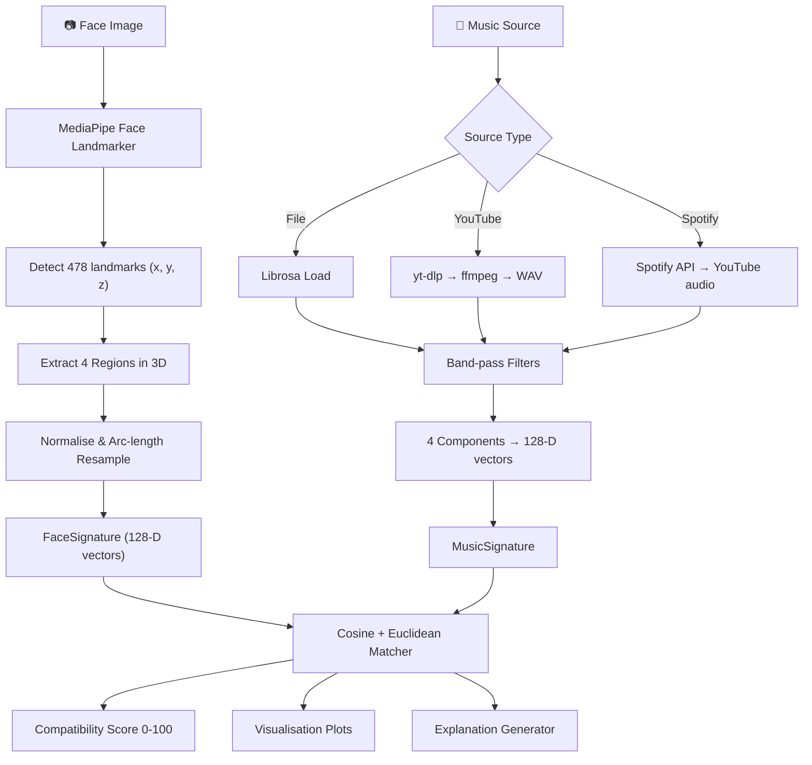

# 🎭🎵 Face Music Matcher

> **Experimental system for mathematical comparison between facial geometry and musical structure.**

---

## 📌 Objective

Face Music Matcher is a **pure mathematical system** that compares the geometry of a human face with the structure of a music track. It does **NOT** predict personality, emotions, or musical tastes.

The core idea:

- A **face** is treated as a set of **geometric curves**.
- A **song** is treated as a set of **sound curves**.
- The system generates **mathematical signatures** for both.
- The system calculates a **compatibility score** between face and music.

This is a computational geometry + digital signal processing experiment. There are no psychological premises.

---

## 🏗️ Architecture

```
┌──────────────────────────────────────────────────────────────┐
│                     Frontend (SPA)                           │
│  📷 Webcam capture  |  📁 File upload  |  🎬 YouTube  |  🟢 Spotify │
└──────────────────────────┬───────────────────────────────────┘
                           │
┌──────────────────────────▼───────────────────────────────────┐
│                       API Layer (FastAPI)                    │
│  POST /compare          — image + music file                │
│  POST /compare/youtube  — image + YouTube URL               │
│  POST /compare/spotify  — image + search query → ranking    │
└──────────────────────────┬───────────────────────────────────┘
                           │
┌──────────────────────────▼───────────────────────────────────┐
│                      Use Cases                               │
│  ExtractFaceSignatureUseCase                                 │
│  ExtractMusicSignatureUseCase                                │
│  CompareFaceAndMusicUseCase                                  │
└──────────────────────────┬───────────────────────────────────┘
                           │
┌──────────────────────────▼───────────────────────────────────┐
│               Domain (Entities + Interfaces)                 │
│  FaceSignature, MusicSignature, ComparisonResult             │
│  FaceExtractor, MusicExtractor, Matcher, PlotGenerator       │
└──────────────────────────┬───────────────────────────────────┘
                           │
┌──────────────────────────▼───────────────────────────────────┐
│                 Infrastructure Adapters                      │
│  MediaPipeFaceExtractor   (MediaPipe Face Landmarker 3D)     │
│  LibrosaMusicExtractor    (Librosa + SciPy)                  │
│  YouTubeAudioDownloader   (yt-dlp + ffmpeg)                  │
│  SpotifyClient            (Spotify Web API)                  │
│  CosineEuclideanMatcher   (Cosine + Euclidean)               │
│  MatplotlibPlotGenerator  (Matplotlib)                       │
│  ExplanationGenerator     (Natural language explanations)    │
└──────────────────────────────────────────────────────────────┘
```

### Design Principles

| Principle       | Applied Through                                    |
|-----------------|----------------------------------------------------|
| **SOLID**       | ABC interfaces, single-responsibility adapters     |
| **Clean Arch**  | Domain ← Use Cases ← Infrastructure               |
| **Clean Code**  | Type hints, docstrings, descriptive names          |
| **Pydantic**    | Request/response validation                        |

---

## 🔄 System Flow



### Face ↔ Music Mapping

| Face Region   | Music Component     | Rationale                                         |
|---------------|---------------------|---------------------------------------------------|
| **Jawline**   | **Bass**            | Structural foundation of face / sonic foundation  |
| **Eyebrows**  | **Rhythm**          | Temporal articulation / rhythmic pulse            |
| **Nose**      | **Mid Frequencies** | Central prominence / harmonic body                |
| **Mouth**     | **Treble**          | Expressive detail / high-frequency texture        |

---

## 📂 Project Structure

```
face_music_matcher/
├── app/
│   ├── api/
│   │   ├── routes/          # FastAPI route handlers
│   │   └── schemas/         # Pydantic request/response models
│   ├── core/
│   │   ├── config.py        # Application configuration
│   │   └── exceptions.py    # Custom exception classes
│   ├── domain/
│   │   ├── entities/        # FaceSignature, MusicSignature, etc.
│   │   ├── interfaces/      # ABCs for adapters
│   │   └── services/        # Domain services (future)
│   ├── infrastructure/
│   │   ├── vision/          # MediaPipe face extractor
│   │   ├── audio/           # Librosa music extractor
│   │   ├── matching/        # Cosine + Euclidean matcher
│   │   └── storage/         # Plot generator
│   └── use_cases/           # Application use cases
├── tests/                   # Pytest test suite (78 tests, 76% coverage)
├── uploads/                 # Temporary file storage
├── outputs/                 # Generated visualisation plots
├── .env                     # Spotify API credentials (gitignored)
├── .gitignore
├── .dockerignore
├── Dockerfile               # Container with Python 3.12 + ffmpeg
├── render.yaml              # Render.com deployment config
├── requirements.txt
└── main.py                  # CLI + Server entry point
```

---

## 🚀 Installation

### Prerequisites

- Python **3.12+**
- pip

### Setup

```bash
# Clone the repository
git clone <repo-url>
cd face_music_matcher

# Create a virtual environment
python -m venv .venv

# Activate it
# Windows:
.venv\Scripts\activate
# Linux/macOS:
source .venv/bin/activate

# Install dependencies
pip install -r requirements.txt
```

---

## 🖥️ Usage

### CLI Mode

```bash
python main.py --image photo.jpg --music song.mp3
```

Output:

```
🔍 Analysing face: photo.jpg
🎵 Analysing music: song.mp3
──────────────────────────────────────────────────

  Compatibility: 87.35%

  Component scores:
    jaw_bass              85.00%
    eyebrow_rhythm        90.00%
    nose_mid              88.00%
    mouth_treble          86.40%

  Plots saved to: outputs/
    face_curve: outputs/face_curve.png
    music_curve: outputs/music_curve.png
    overlay_comparison: outputs/overlay_comparison.png

✅ Comparison complete.
```

JSON output:

```bash
python main.py --image photo.jpg --music song.mp3 --json
```

### Server Mode (FastAPI)

```bash
python main.py --server
# or with custom host/port:
python main.py --server --host 0.0.0.0 --port 8080
```

Then open the **interactive frontend** at:

- **Frontend**: http://127.0.0.1:8000
- **Swagger UI**: http://127.0.0.1:8000/docs
- **ReDoc**: http://127.0.0.1:8000/redoc

### Webcam Capture

```bash
python main.py --camera --music song.mp3
```

Opens the webcam with a live preview. Press **SPACE** to capture, **ESC** to quit.

---

## 🖥️ Frontend

The interactive frontend supports **three music input modes**:

| Tab | Description |
|-----|-------------|
| 📁 **Ficheiro** | Upload a face photo + MP3/WAV file |
| 🎬 **YouTube** | Upload a face photo + paste a YouTube link |
| 🟢 **Spotify** | Upload a face photo + search artist/track → ranked results |

All modes include:
- 📷 Webcam capture with preview
- 📊 Component score bars (Jawline↔Bass, Eyebrows↔Rhythm, Nose↔Mid, Mouth↔Treble)
- 📈 Comparison plots (face curves, music curves, overlay)
- 📝 Natural language explanations for each score

---

## 📡 API Reference

### `POST /compare`

Upload image + music file.

**Request:**

| Field   | Type | Required | Description               |
|---------|------|----------|---------------------------|
| `image` | file | Yes      | Face image (JPEG or PNG)  |
| `music` | file | Yes      | Music file (WAV or MP3)   |

### `POST /compare/youtube`

Upload image + YouTube URL.

| Field        | Type   | Required | Description                          |
|--------------|--------|----------|--------------------------------------|
| `image`      | file   | Yes      | Face image (JPEG or PNG)             |
| `youtube_url`| string | Yes      | YouTube URL (watch or youtu.be)      |

### `POST /compare/spotify`

Upload image + search query → ranked results.

| Field        | Type   | Required | Description                          |
|--------------|--------|----------|--------------------------------------|
| `image`      | file   | Yes      | Face image (JPEG or PNG)             |
| `query`      | string | Yes      | Search query (artist or track name)  |
| `search_type`| string | No       | `"artist"` (default) or `"track"`     |

**Spotify Response:**

```json
{
  "query": "Billie Eilish",
  "total_tracks_found": 5,
  "tracks_analyzed": 5,
  "results": [
    {
      "track_name": "bad guy",
      "artist": "Billie Eilish",
      "album": "WHEN WE ALL FALL ASLEEP",
      "compatibility": 73.5,
      "component_scores": {
        "jaw_bass": 70.1,
        "eyebrow_rhythm": 82.3,
        "nose_mid": 74.0,
        "mouth_treble": 67.6
      },
      "spotify_url": "https://open.spotify.com/track/..."
    }
  ],
  "plot_paths": { "face_curve": "...", "music_curve": "...", "overlay_comparison": "..." },
  "explanation": { "overall": "...", "pairs": { ... } }
}
```

**Example (curl):**

```bash
# File upload
curl -X POST http://127.0.0.1:8000/compare \
  -F "image=@photo.jpg" \
  -F "music=@song.mp3"

# YouTube
curl -X POST http://127.0.0.1:8000/compare/youtube \
  -F "image=@photo.jpg" \
  -F "youtube_url=https://www.youtube.com/watch?v=..."

# Spotify
curl -X POST http://127.0.0.1:8000/compare/spotify \
  -F "image=@photo.jpg" \
  -F "query=Billie Eilish" \
  -F "search_type=artist"
```

**Response (200):**

```json
{
  "compatibility": 87.35,
  "face_score": {
    "jaw_vector": [0.12, 0.15, "..."],
    "eyebrow_vector": [0.08, 0.11, "..."],
    "nose_vector": [0.22, 0.25, "..."],
    "mouth_vector": [0.05, 0.09, "..."]
  },
  "music_score": {
    "bass_vector": [0.10, 0.13, "..."],
    "mid_vector": [0.20, 0.22, "..."],
    "treble_vector": [0.05, 0.08, "..."],
    "rhythm_vector": [0.30, 0.33, "..."]
  },
  "component_scores": {
    "jaw_bass": 85.0,
    "eyebrow_rhythm": 90.0,
    "nose_mid": 88.0,
    "mouth_treble": 86.4
  },
  "plot_paths": {
    "face_curve": "outputs/abc123_face_curve.png",
    "music_curve": "outputs/abc123_music_curve.png",
    "overlay_comparison": "outputs/abc123_overlay_comparison.png"
  },
  "explanation": {
    "overall": "Compatibilidade alta (87.4%) entre o rosto e a música...",
    "pairs": {
      "jaw_bass": { "score": 85.0, "level": "Forte alinhamento", ... }
    }
  }
}
```

---

## 🧪 Testing

```bash
# Run all tests (78 tests)
pytest

# With coverage report (76% coverage)
pytest --cov=app --cov-report=term-missing --cov-report=html
```

## 🐳 Deployment

The project includes a `Dockerfile` (Python 3.12 + ffmpeg) and `render.yaml` for
easy deployment to Render.com (free tier). Also compatible with AWS, Fly.io,
Railway, and Google Cloud Run.

```bash
# Build and run locally
docker build -t face-music-matcher .
docker run -p 8000:8000 face-music-matcher
```

## 🔑 Environment Variables

| Variable | Required | Description |
|----------|----------|-------------|
| `SPOTIFY_CLIENT_ID` | For Spotify | Spotify API client ID |
| `SPOTIFY_CLIENT_SECRET` | For Spotify | Spotify API client secret |

Create a `.env` file in the project root:

```
SPOTIFY_CLIENT_ID=your_client_id
SPOTIFY_CLIENT_SECRET=your_client_secret
```

---

## 🧠 Technical Details

---

### 🖼️ Computer Vision Pipeline

The face image goes through **six independent extractors**, each producing a
128-D vector. These are combined into a single FaceSignature.

#### 1. Geometric Signature — MediaPipe Face Landmarker (3D)

| Step | Technique | Output |
|------|-----------|--------|
| 1 | MediaPipe Face Landmarker | 478 landmarks (x, y, z) |
| 2 | Select 4 anatomical regions | jawline (17 pts), eyebrows (20), nose (17), mouth (20) |
| 3 | Centre on centroid | Translation invariance |
| 4 | Normalise by max distance | Scale invariance |
| 5 | Arc-length interpolation | 256 samples per dimension |
| 6 | Interleave x, y, z → 768 → downsample | **128-D vector** |

**Contribution**: Captures the 3D anatomical structure independent of face size
and position. The `z` coordinate provides depth information, reducing sensitivity
to head pose.

#### 2. Edge Signature — Sobel Operator

| Step | Technique | Output |
|------|-----------|--------|
| 1 | Convert to grayscale, resize 256×256 | Normalised image |
| 2 | `cv2.Sobel(gx)` + `cv2.Sobel(gy)` | Horizontal + vertical gradients |
| 3 | `sqrt(gx² + gy²)` | Gradient magnitude |
| 4 | Interleave (gx, gy, mag) → downsample | **128-D vector** |

**Contribution**: Extracts directional edges and texture. Sharp jawlines and
defined eyebrows produce stronger Sobel responses, capturing facial definition.

#### 3. Contour Signature — Canny Edge Detector

| Step | Technique | Output |
|------|-----------|--------|
| 1 | `cv2.Canny(low=50, high=150)` | Binary edge map |
| 2 | Row/column edge profiles | Horizontal + vertical edge density |
| 3 | 16×16 block edge density | Spatial distribution map |
| 4 | Concatenate profiles → resample | **128-D vector** |

**Contribution**: Detects structural contours. Differentiates smooth vs angular
facial features through edge count and spatial distribution.

#### 4. Orientation Signature — Hough Line Transform

| Step | Technique | Output |
|------|-----------|--------|
| 1 | Canny edges as input | Binary edge map |
| 2 | `cv2.HoughLinesP` | Detected line segments |
| 3 | Compute angle per line | Angles in [0°, 180°) |
| 4 | 36-bin angular histogram → resample | **128-D vector** |

**Contribution**: Measures dominant line orientations. A square jaw produces
near-horizontal lines; an oval face has more curved (distributed) angles.

#### 5. Histogram Signature — Grayscale Distribution

| Step | Technique | Output |
|------|-----------|--------|
| 1 | `cv2.calcHist` (256 bins) | Original histogram |
| 2 | `cv2.equalizeHist` + calcHist | Equalised histogram |
| 3 | Interleave both → downsample | **128-D vector** |

**Contribution**: Captures global brightness and contrast distribution.
Complements edge-based signatures with tonal information.

#### 6. Entropy Signature — Shannon Entropy

| Step | Technique | Output |
|------|-----------|--------|
| 1 | Global Shannon entropy | Visual complexity (scalar) |
| 2 | 8×8 block local entropy | Spatial complexity map |
| 3 | Concatenate + resample | **128-D vector** |

**Contribution**: Quantifies visual information content. High-entropy faces
(glasses, facial hair, texture) differ from low-entropy (smooth, uniform).

---

### 🎵 Digital Signal Processing Pipeline

Music is analysed in **two layers**: frequency-band decomposition and
spectrogram-based DSP.

#### Layer 1: Frequency Bands (Original)

| Component | Range | Technique |
|-----------|-------|-----------|
| **Bass** | 20–250 Hz | Butterworth band-pass (4th order) → envelope → 128-D |
| **Mid** | 250–2,000 Hz | Butterworth band-pass → envelope → 128-D |
| **Treble** | 2,000–8,000 Hz | Butterworth band-pass → envelope → 128-D |
| **Rhythm** | — | `librosa.feature.rms` → 128-D |

#### Layer 2: Spectrogram Analysis (New)

All spectrogram extractors start from a **Mel spectrogram** (128 mel bands,
dB scale) computed via `librosa.feature.melspectrogram`.

| Extractor | Technique | What it captures |
|-----------|-----------|-----------------|
| **Spectrogram** | Frequency + time profiles | Spectral energy distribution |
| **Spectrogram Sobel** | `cv2.Sobel` on spectrogram image | Transients, note onsets, attacks |
| **Spectrogram Histogram** | Histogram + spectral contrast | Spectral dynamic range |
| **Spectrogram Entropy** | Per-band + per-frame Shannon entropy | Spectral complexity and variation |

**Architecture note**: Applying OpenCV to the spectrogram treats it as an image,
bridging audio DSP with computer vision techniques.

#### Spotify Integration

1. Search Spotify API (`artist:NAME` or `track:NAME`)
2. For each track, search YouTube via `yt-dlp` (`ytsearch:track artist`)
3. Download → convert to WAV via ffmpeg
4. Extract MusicSignature → compare with FaceSignature
5. Return top N ranked by compatibility

#### YouTube Audio Extraction

Uses `yt-dlp` with `worstaudio` format for speed. Requires `ffmpeg` for WAV
conversion.

---

### 🧮 Mathematical Matching Pipeline (Hybrid)

The HybridMatcher combines three independent comparison layers with weighted
scoring:

```
compatibility = 0.40 × geometric_score + 0.35 × structural_score + 0.25 × statistical_score
```

#### Layer 1: Geometric (weight 40%)

| Face | Music | Rationale |
|------|-------|-----------|
| Jawline ↔ Bass | Foundation | Structural base of face / sonic foundation |
| Eyebrows ↔ Rhythm | Articulation | Temporal articulation / rhythmic pulse |
| Nose ↔ Mid | Centre | Central axis / harmonic core |
| Mouth ↔ Treble | Detail | Expressive detail / high-frequency texture |

Each pair uses **cosine similarity (70%) + Euclidean distance (30%)**.
The four scores are averaged.

#### Layer 2: Structural (weight 35%)

| Face | Music | Rationale |
|------|-------|-----------|
| Face Edge (Sobel) ↔ Spectrogram Edge | Both detect gradients and transitions |
| Face Contour (Canny) ↔ Spectrogram Structure | Both capture structural boundaries |
| Face Orientation (Hough) ↔ Spectrogram Transitions | Both measure directional patterns |

Averages the three pairwise scores. Falls back to 50% if vectors are missing.

#### Layer 3: Statistical (weight 25%)

| Face | Music | Rationale |
|------|-------|-----------|
| Histogram ↔ Spectrogram Histogram | Both capture energy/tonal distribution |
| Entropy ↔ Spectrogram Entropy | Both quantify information complexity |

Averages the two pairwise scores.

#### Score Interpretation

| Range | Level | Meaning |
|-------|-------|---------|
| 80–100% | Very High | Exceptional mathematical alignment across layers |
| 60–80% | High | Good correspondence with some divergence |
| 40–60% | Moderate | Some alignment but considerable differences |
| 0–40% | Low | Curves follow very different trajectories |

---

### ⚡ Performance Optimisation

#### SHA256 Signature Cache

- Face signatures are cached by SHA256 hash of the image file
- Music signatures are cached by SHA256 hash of the audio file
- Same file → instant lookup (no recomputation)
- In-memory cache (no external dependency)

#### YouTube Download Optimisation

- Uses `worstaudio` quality for fastest downloads
- Low bitrate WAV conversion (32K) — sufficient for envelope extraction
- 90-second per-track timeout
- 5 tracks max per Spotify search (configurable)

---

### 📐 Architecture Decision Records (ADR)

#### ADR-001: Why 128-D vectors?

Balance between information preservation and computational efficiency.
128 dimensions capture enough structure for meaningful comparison while
keeping RAM usage low (~4 KB per signature).

#### ADR-002: Why Cosine + Euclidean hybrid?

Cosine similarity is scale-invariant but ignores magnitude. Euclidean
distance captures absolute differences but is sensitive to scale.
Combining both (70/30) gives a robust similarity measure.

#### ADR-003: Why three-layer matching?

A single comparison layer (e.g., only geometric) is too narrow. Three
independent layers (geometric, structural, statistical) provide triangulation:
each layer captures different aspects of the face-music relationship.

#### ADR-004: Why OpenCV on spectrograms?

Treating the spectrogram as an image allows reusing the same computer
vision techniques (Sobel, histogram, entropy) on both face images and
audio representations. This creates a unified mathematical framework.

#### ADR-005: Why no ML/neural networks?

The project is an experiment in pure mathematical comparison.
Classical CV and DSP techniques are deterministic, interpretable,
and don't require training data. Every score can be traced back to
specific mathematical operations.

---

## 🔮 Architecture Prepared for Future Expansion

The Clean Architecture design makes it straightforward to add:

1. ✅ **YouTube URL upload** — Already implemented.
2. ✅ **Music ranking** — Already implemented (Spotify search → ranked results).
3. **Face Playlist** — Match a face against a user's Spotify playlists (OAuth login).
4. **Multi-song compatibility** — Compare one face to an entire library.
5. **Persistent face signatures** — Store and reuse signatures.
6. **Spotify OAuth login** — User logs in, selects playlists, ranks their music.

The interface-based design means these can be added by creating new adapters
and use cases without modifying existing code.

---

## ⚠️ Important Notes

- No database.
- No AI / generative models.
- No neural networks.
- No emotion classification.
- No personality inference.
- No musical taste prediction.
- Pure mathematics: geometric curve similarity.

---

## 📄 License

MIT